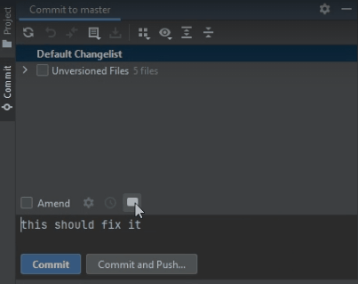

| Nick na githubie | Imię i nazwisko    | Indeks |
|------------------|--------------------|--------|
| mmalarski        | Michał Malarski    | 229951 |
| Hanna-J-K        | Hanna Kraska       | 229925 |
| Daxir            | Mateusz Roszkowski | 229990 |
| kwisnia          | Kacper Wiśniewski  | 230037 |

Wtyczka generuje wiadomości do commitów pobierając je ze strony whatthecommit.com.

By wygenerować komentarz, w okienku commita należy wcisnąć nowy przycisk z ikoną chmurki.

